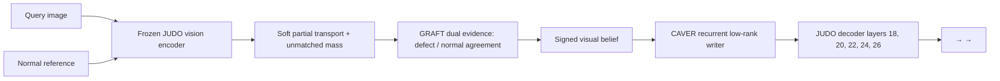

# FREB-CAVER

**[Research] Model-native causal visual-evidence binding for industrial anomaly reasoning with JUDO.**

[한국어 요약](README.ko.md) · [Method](METHOD.md) · [Results](RESULTS.md) · [Reproducibility](REPRODUCIBILITY.md)

FREB-CAVER is a lightweight research adapter for the public
[JUDO](https://github.com/woodavid31/JUDO) checkpoint. It aligns a query image
with its normal reference, preserves unmatched defect evidence, separates
defect and normal-agreement subspaces, and writes a signed visual belief into
JUDO's grounded chain-of-thought and answer states. The JUDO backbone remains
frozen. There is no external router and no inference-time decision threshold.

## Main finding

The strongest evidence is a one-time, asset-disjoint, balanced 1,120-question
MMAD paired holdout:

| Model | Overall accuracy | AD balanced accuracy |
|---|---:|---:|
| Frozen public JUDO | 80.0893% | 65.6250% |
| FREB-CAVER | **81.0714%** | 65.6250% |
| Paired change | **+0.9821 pp** | 0.0000 pp |

The overall paired change passed the exact McNemar test (`p=0.043285`) and a
10,000-replicate cluster bootstrap gave a 95% interval of `+0.0908` to
`+1.8683` percentage points. However, the preregistered joint claim was **not
confirmed** because anomaly-detection balanced accuracy did not improve. The
adapter improves overall MMAD behavior, but it does not yet solve JUDO's anomaly
over-detection failure mode.

A separate 39,670-question full-MMAD run produced 81.9063% normalized 28-cell
macro accuracy and 81.2150% micro accuracy. This is a coverage and behavior
audit—not an unbiased held-out headline—because 6,160 rows (15.53%) were used
during Stage-4 training or model selection. See [RESULTS.md](RESULTS.md) for the
complete interpretation.

## Architecture



The final factorized checkpoint freezes the visual estimator and uses a
half-strength recurrent writer (`visual_alpha=0.0`, `writer_alpha=0.5`). The
adapter contains 33,077,654 parameters, approximately 0.4% of the 8.29B-parameter
base model. Zero-initialized output paths make a newly installed adapter an
exact functional identity before training.

## Repository layout

| Path | Contents |
|---|---|
| `freb_caver/` | Core transport, GRAFT, CAVER, training, evaluation, and data utilities |
| `freb_caver/tests/` | Identity, causality, phase-mask, transport, and metric tests |
| `configs/` | Sealed preregistration records |
| `results/` | Machine-readable full-MMAD and independent-holdout summaries |
| `weights/` | Checkpoint identity and release download instructions |

## Quick start

FREB-CAVER deliberately does not redistribute JUDO or MMAD. Accept their terms
and prepare them separately.

```bash
git clone https://github.com/choi0312/FREB-CAVER.git
cd FREB-CAVER

git clone https://github.com/woodavid31/JUDO third_party/JUDO
hf download woodavid31/JUDO --local-dir checkpoints/JUDO

python -m pip install -r requirements.txt
gh release download v0.1.0 --pattern "native_deep_residual*" --dir checkpoints/FREB-CAVER

export JUDO_REPO="$PWD/third_party/JUDO"
export JUDO_CAVER_ADAPTER_DIR="$PWD/checkpoints/FREB-CAVER"
python freb_caver/eval_judo_caver.py \
  --model-path checkpoints/JUDO \
  --data-root /path/to/MMAD \
  --manifest /path/to/frozen_manifest.jsonl \
  --output-dir runs/freb-caver-eval \
  --run-name freb-caver-eval \
  --enable-kv-cache
```

Install the PyTorch build appropriate for the target GPU before installing the
remaining requirements. Google Cloud/Colab G4 uses a Blackwell GPU and requires
a CUDA/PyTorch build with Blackwell support.

Run the model-level tests with:

```bash
python -m pytest freb_caver/tests -q
```

## Checkpoint

Release `v0.1.0` provides the 132,318,080-byte adapter and its identity record.
The expected SHA-256 is:

```text
ac3233dbee2de9dd1aaea4acede275ddc2d7a322427795717d9232291e03b0ed
```

## Scope and licensing

This is research software, not a production anomaly-detection system. MMAD
licenses, JUDO model terms, and the upstream JUDO repository apply separately.
The upstream JUDO repository currently declares no explicit software license;
therefore this repository does not silently relicense or redistribute upstream
JUDO code. See [NOTICE.md](NOTICE.md).

## Citation

Use [CITATION.cff](CITATION.cff) for this artifact and cite the original JUDO
paper and MMAD dataset when reporting results.
